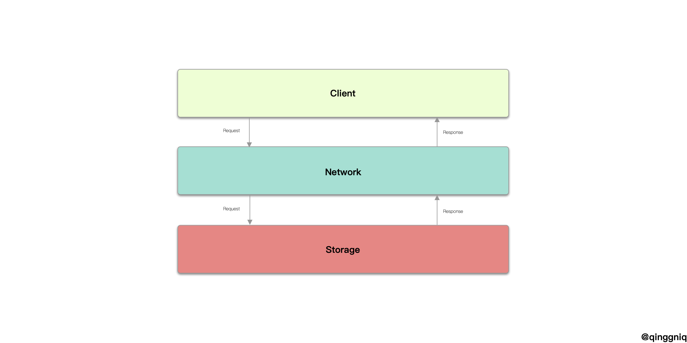
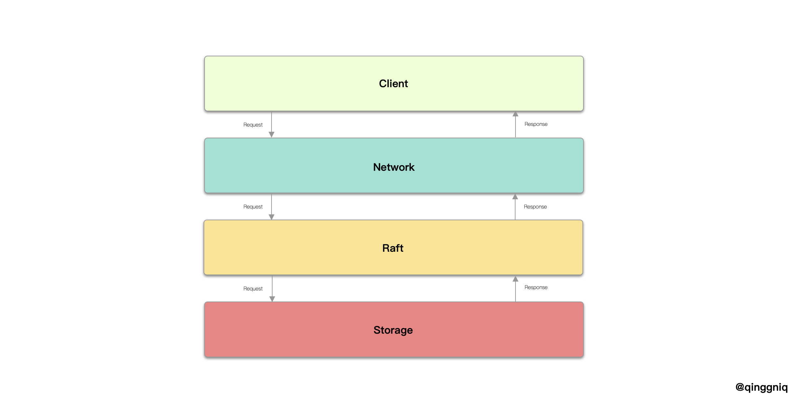

# Etcd概述

## 背景

之前做MIT6.824看了Raft算法，lab2实现了Raft算法中**选主**和**日志复制**的基本功能，然而在看到[etcd](https://github.com/etcd-io/etcd)里面的实现之后顿时觉得自己写的就是一堆垃圾，所以决定好好研究一下**etcd**的代码。

## 声明

此系列的文章分析的是截止到**2020-01-23**[这个版本](https://github.com/etcd-io/etcd/tree/c3497c84ed7860fe3accbcd648d7bebfe49de02b)的mastre分支的etcd代码。

## etcd是什么

> ![](data:image/svg+xml;base64,PD94bWwgdmVyc2lvbj0iMS4wIiBlbmNvZGluZz0idXRmLTgiPz4NCjwhLS0gR2VuZXJhdG9yOiBB%0D%0AZG9iZSBJbGx1c3RyYXRvciAxNy4wLjAsIFNWRyBFeHBvcnQgUGx1Zy1JbiAuIFNWRyBWZXJzaW9u%0D%0AOiA2LjAwIEJ1aWxkIDApICAtLT4NCjwhRE9DVFlQRSBzdmcgUFVCTElDICItLy9XM0MvL0RURCBT%0D%0AVkcgMS4xLy9FTiIgImh0dHA6Ly93d3cudzMub3JnL0dyYXBoaWNzL1NWRy8xLjEvRFREL3N2ZzEx%0D%0ALmR0ZCI+DQo8c3ZnIHZlcnNpb249IjEuMSIgaWQ9IkxheWVyXzEiIHhtbG5zPSJodHRwOi8vd3d3%0D%0ALnczLm9yZy8yMDAwL3N2ZyIgeG1sbnM6eGxpbms9Imh0dHA6Ly93d3cudzMub3JnLzE5OTkveGxp%0D%0AbmsiIHg9IjBweCIgeT0iMHB4Ig0KCSB3aWR0aD0iMjk4cHgiIGhlaWdodD0iMTExcHgiIHZpZXdC%0D%0Ab3g9IjE1Ni41IDM0MC41IDI5OCAxMTEiIGVuYWJsZS1iYWNrZ3JvdW5kPSJuZXcgMTU2LjUgMzQw%0D%0ALjUgMjk4IDExMSIgeG1sOnNwYWNlPSJwcmVzZXJ2ZSI+DQo8Zz4NCgk8Zz4NCgkJPHBhdGggZmls%0D%0AbD0iIzQxOUVEQSIgZD0iTTIwMy4xNDQsMzk4Ljg1M2MwLDMuMjQtMi42MjgsNS44NjMtNS44NjMs%0D%0ANS44NjNjLTMuMjM3LDAtNS44NTgtMi42MjMtNS44NTgtNS44NjMNCgkJCWMwLTMuMjI2LDIuNjIy%0D%0ALTUuODU5LDUuODU4LTUuODU5QzIwMC41MTYsMzkyLjk5MywyMDMuMTQ0LDM5NS42MjcsMjAzLjE0%0D%0ANCwzOTguODUzeiIvPg0KCQk8cGF0aCBmaWxsPSIjNDE5RURBIiBkPSJNMjEwLjcyMiwzOTguODUz%0D%0AYzAsMy4yNDQsMi42MjQsNS44NjQsNS44NjMsNS44NjRjMy4yMzUsMCw1Ljg2My0yLjYyLDUuODYz%0D%0ALTUuODY0DQoJCQljMC0zLjIyOC0yLjYyOC01Ljg1OS01Ljg2My01Ljg1OUMyMTMuMzQ2LDM5Mi45%0D%0AOTMsMjEwLjcyMiwzOTUuNjI1LDIxMC43MjIsMzk4Ljg1M3oiLz4NCgkJPHBhdGggZmlsbD0iIzQx%0D%0AOUVEQSIgZD0iTTI1MC42MjMsNDA1LjIxMmMtMC40MjUsMC4wMzQtMC44NDUsMC4wNDktMS4yOTUs%0D%0AMC4wNDljLTIuNjE2LDAtNS4xNTItMC42MTItNy40NDEtMS43MzINCgkJCWMwLjc2LTQuMzc0LDEu%0D%0AMDg2LTguNzc1LDEuMDAyLTEzLjE2M2MtMi40ODItMy41OTItNS4zMTctNi45NzctOC41MTktMTAu%0D%0AMDk1YzEuMzg5LTIuNjA0LDMuNDQ0LTQuODQ1LDYuMDAzLTYuNDNsMS4xMDItMC42ODMNCgkJCWwt%0D%0AMC44Ni0wLjk3MWMtNC40MTctNC45Ny05LjY4Ni04LjgxNS0xNS42NjYtMTEuNDI2bC0xLjE5Mi0w%0D%0ALjUxOGwtMC4zMDMsMS4yNTdjLTAuNzE0LDIuOTM2LTIuMjAyLDUuNTg1LTQuMjQ4LDcuNzExDQoJ%0D%0ACQljLTMuOTMxLTIuMDg4LTguMDM4LTMuNzc3LTEyLjI3NC01LjA1NmMtNC4yMjYsMS4yNzYtOC4z%0D%0AMjksMi45Ni0xMi4yNTYsNS4wNDhjLTIuMDQtMi4xMjMtMy41MjItNC43NjgtNC4yMzEtNy42OTRs%0D%0ALTAuMzA4LTEuMjYxDQoJCQlsLTEuMTg4LDAuNTE2Yy01LjkwMSwyLjU3MS0xMS4zMTksNi41MjEt%0D%0AMTUuNjY1LDExLjQyMmwtMC44NTksMC45NzFsMS4xLDAuNjgyYzIuNTU2LDEuNTgsNC42LDMuODA4%0D%0ALDUuOTg5LDYuMzk2DQoJCQljLTMuMTksMy4xMDgtNi4wMjYsNi40ODQtOC41MDQsMTAuMDU4Yy0w%0D%0ALjA5Niw0LjM4MywwLjIxMiw4LjgxOCwwLjk3NiwxMy4yNWMtMi4yNzgsMS4xMS00Ljc5OCwxLjcx%0D%0ANy03LjM5NiwxLjcxNw0KCQkJYy0wLjQ1NSwwLTAuODgzLTAuMDE1LTEuMjk4LTAuMDQ5TDE2Miw0%0D%0AMDUuMTFsMC4xMiwxLjI5YzAuNjM2LDYuNTIyLDIuNjU4LDEyLjcyOSw2LjAyNiwxOC40NDJsMC42%0D%0ANTYsMS4xMTdsMC45ODQtMC44MzgNCgkJCWMyLjI4Ny0xLjkzOCw1LjA0Ny0zLjIyMiw3Ljk4NS0z%0D%0ALjczOGMxLjkzNywzLjk1Niw0LjIyOSw3LjY3Niw2LjgzNCwxMS4xM2M0LjE1MiwxLjQ1Miw4LjQ3%0D%0AOSwyLjUzOCwxMi45NDksMy4xODQNCgkJCWMwLjQyOSwyLjk1MiwwLjA4Nyw2LjAwOS0xLjA3OCw4%0D%0ALjgzNWwtMC40OTIsMS4xOThsMS4yNjQsMC4yOGMzLjIzNiwwLjcxNCw2LjUwMSwxLjA3Myw5Ljcw%0D%0AMiwxLjA3M2w5LjctMS4wNzNsMS4yNjUtMC4yOA0KCQkJbC0wLjQ5LTEuMTk4Yy0xLjE2NS0yLjgy%0D%0ANi0xLjUwOS01Ljg4OC0xLjA3NS04Ljg0NWM0LjQ0OC0wLjY0NSw4Ljc1OC0xLjcyOCwxMi44OTct%0D%0AMy4xNzRjMi42MDctMy40NTQsNC45MDMtNy4xNzksNi44MzktMTEuMTQNCgkJCWMyLjk0OCwwLjUx%0D%0AMiw1LjcyNywxLjc5Niw4LjAyNSwzLjc0MmwwLjk4NSwwLjgzNGwwLjY1Ny0xLjEwOGMzLjM3LTUu%0D%0ANzI2LDUuMzk1LTExLjkzLDYuMDE5LTE4LjQ0MWwwLjEyLTEuMjg5TDI1MC42MjMsNDA1LjIxMnoN%0D%0ACgkJCSBNMjIwLjgxNSw0MjAuOTc1Yy00LjU5MiwxLjI0NS05LjI1LDEuODc1LTEzLjg4MiwxLjg3%0D%0ANWMtNC42NDgsMC05LjMwMS0wLjYzLTEzLjg5My0xLjg3NWMtMi41Mi0zLjkxNC00LjUxMi04LjEw%0D%0AOC01Ljk0NC0xMi41MjQNCgkJCWMtMS40MjktNC4zOTctMi4yNjUtOS0yLjUwOC0xMy43NDFjMi45%0D%0ANjgtMy42NjgsNi4zNC02Ljg4MSwxMC4wNjctOS41ODNjMy43ODctMi43NTQsNy45MDUtNC45OTMs%0D%0AMTIuMjc4LTYuNjc5DQoJCQljNC4zNjUsMS42ODYsOC40NzcsMy45MTksMTIuMjUzLDYuNjYxYzMu%0D%0ANzQsMi43Miw3LjEyOSw1Ljk1NiwxMC4xMTEsOS42NDljLTAuMjU2LDQuNzEyLTEuMTA0LDkuMjkx%0D%0ALTIuNTMxLDEzLjY4DQoJCQlDMjI1LjMzNCw0MTIuODU0LDIyMy4zMzUsNDE3LjA2MSwyMjAuODE1%0D%0ALDQyMC45NzV6Ii8+DQoJPC9nPg0KCTxnPg0KCQk8cGF0aCBkPSJNMjg3LjU1NCwzNzAuMzI3YzE0%0D%0ALjcyNSwwLDIzLjAzOCwxMC41NjksMjMuMDM4LDI3LjA3NGMwLDIuMDE5LTAuMTIsMy45MTktMC4z%0D%0ANTcsNS4zNDNoLTM4Ljk1DQoJCQljMC43MTMsMTIuNDcsOC4xOTYsMjAuMzA4LDE5LjIzNywyMC4z%0D%0AMDhjNS40NjIsMCwxMC4wOTItMS43ODIsMTQuMzY4LTQuNTEzbDMuNDQzLDYuNDExYy00Ljk4Nywz%0D%0ALjIwNy0xMS4xNjIsNS45MzgtMTguOTk4LDUuOTM4DQoJCQljLTE1LjQzNywwLTI3LjY2OC0xMS4y%0D%0AOC0yNy42NjgtMzAuMTYzQzI2MS42NjcsMzgxLjg0NywyNzQuMzcxLDM3MC4zMjcsMjg3LjU1NCwz%0D%0ANzAuMzI3eiBNMzAyLjA0MiwzOTYuMzMyDQoJCQljMC0xMS43NTYtNS4yMjUtMTguMjg1LTE0LjI1%0D%0ALTE4LjI4NWMtOC4wNzUsMC0xNS40MzgsNi42NDgtMTYuNjI1LDE4LjI4NUgzMDIuMDQyeiIvPg0K%0D%0ACQk8cGF0aCBkPSJNMzIxLjYzMywzNzkuNzA4aC04LjU1di03LjM2Mmw5LjAyNC0wLjU5NGwxLjE4%0D%0AOS0xNi4xNDloOC4xOTF2MTYuMTQ5aDE1LjU1N3Y3Ljk1N2gtMTUuNTU3djMyLjA2Mg0KCQkJYzAs%0D%0ANy4xMjYsMi4yNTksMTEuMTYyLDguOTA3LDExLjE2MmMyLjAyLDAsNC42MzItMC44MzEsNi41MzIt%0D%0AMS41NDVsMS44OTcsNy4zNjRjLTMuMjA1LDEuMDY4LTcuMTIzLDIuMTM4LTEwLjY4NywyLjEzOA0K%0D%0ACQkJYy0xMi4zNDgsMC0xNi41MDYtNy44MzctMTYuNTA2LTE5LjIzN3YtMzEuOTQ1SDMyMS42MzN6%0D%0AIi8+DQoJCTxwYXRoIGQ9Ik0zNzguODcxLDM3MC4zMjdjNy42LDAsMTIuOTQyLDMuMjA3LDE2Ljg2%0D%0ALDYuODg4bC00Ljg2Nyw2LjI5MmMtMy40NDQtMi45NjYtNy4wMDYtNS4xMDQtMTEuNjM4LTUuMTA0%0D%0ADQoJCQljLTEwLjQ0OCwwLTE4LjA1LDkuMDIzLTE4LjA1LDIyLjMyM2MwLDEzLjE4Miw3LjI0NCwy%0D%0AMi4wODgsMTcuODEzLDIyLjA4OGM1LjQ2MiwwLDEwLjA5NS0yLjczMSwxMy41MzctNS44MThsNC4z%0D%0AOTQsNi40MTINCgkJCWMtNS4yMjUsNC42MzEtMTEuODc2LDcuNDgxLTE4Ljc2NCw3LjQ4MWMtMTUu%0D%0AMzE1LDAtMjcuMDcyLTExLjA0NC0yNy4wNzItMzAuMTYzQzM1MS4wODUsMzgxLjM3MSwzNjQuMDI4%0D%0ALDM3MC4zMjcsMzc4Ljg3MSwzNzAuMzI3DQoJCQl6Ii8+DQoJCTxwYXRoIGQ9Ik00MjQuNDcxLDM3%0D%0AMC4zMjdjNi42NDksMCwxMS4wNDIsMi40OTQsMTYuMTQ5LDYuNjUxbC0wLjQ3Ni05Ljg1NnYtMjIu%0D%0AMjA2SDQ1MHY4NC41NDZoLTguMDcybC0wLjgzNC02Ljc2OGgtMC4zNTUNCgkJCWMtNC41MTMsNC4z%0D%0AOTQtMTAuNjg2LDguMTk0LTE3LjQ1Niw4LjE5NGMtMTQuNDg3LDAtMjMuODY3LTEwLjkyNS0yMy44%0D%0ANjctMzAuMTYzQzM5OS40MTUsMzgxLjk2NSw0MTEuMjksMzcwLjMyNyw0MjQuNDcxLDM3MC4zMjd6%0D%0ADQoJCQkgTTQyNS40Miw0MjIuNjk0YzUuMzQzLDAsOS45NzYtMi42MTIsMTQuNzI1LTcuOTU0di0z%0D%0AMC4xNjRjLTQuODctNC4zOTMtOS4yNjItNi4wNTYtMTQuMDEyLTYuMDU2DQoJCQljLTkuMjYzLDAt%0D%0AMTYuNjI0LDguOTA1LTE2LjYyNCwyMi4wODhDNDA5LjUwOSw0MTQuMzgzLDQxNS4zMjYsNDIyLjY5%0D%0ANCw0MjUuNDIsNDIyLjY5NHoiLz4NCgk8L2c+DQo8L2c+DQo8L3N2Zz4NCg==)
>
> etcd is a distributed reliable **key-value store** for the most critical data of a **distributed system**, with a focus on being:
>
> - *Simple*: well-defined, user-facing API (gRPC)
> - *Secure*: automatic TLS with optional client cert authentication
> - *Fast*: benchmarked 10,000 writes/sec
> - *Reliable*: properly distributed using Raft
>
> etcd is written in Go and **uses the [Raft](https://raft.github.io/) consensus algorithm** to manage a **highly-available replicated log**.

这是**etcd**在GitHub上面的说明，首先它是一个键值数据库，其次它使用**[Raft](https://raft.github.io/) 共识算法**管理高可用的复制日志。所以**etcd**不仅仅是个键值数据库（如**redis**），也不仅仅是个**raft**库（只实现Raft算法），而是兼有之，也就是高可用强一致性的分布式数据库。然而由于它的设计目的在于**集群元信息（配置、成员信息等）管理和分布式协调工作（分布式锁、租约等）**之类的数据量不大的场景，所以在存储方面**etcd**不适用于GB级别的数据存储。由于**etcd**要在分布式场景下使用，所以**网络**部分也是**etcd**需要实现的一部分。所以接下来的系列将会就：

- Raft算法模块
  - 选主
  - 日志复制
- 网络模块
  - peer to peer 网络
  - client to node 网络
- 存储模块
  - 日志存储
  - 键值存储

这三个部分对**etcd**源码进行分析。

## Etcd架构

如上图是一个简单的数据库的模块图，数据库客户端向数据库服务端发起**CRUD**请求，数据库的网络模块负责与客户端的链接，存储模块进行具体的操作，然后将执行结果返回给网络模块，网络模块讲结果发送给客户端。

而**etcd**通过实现**raft共识算法**实现了服务的数据存储服务的高可用，所以对于客户端（**Client**）发过来的**每条请求（request）**都需要使用**raft共识算法**让多个机器对这个请求达成共识，然后才能实际的存储到可持久化存储（**Storage**）中，当结点成员信息发生变化（新加入一个数据结点、原有的主节点失效）的时候需要使用**raft共识算法**对主节点达成共识、发送**快照**让新加入的结点的存储状态和主节点保持一致。

所以在**Http/Socket**网络模块到**Storage**存储模块中间增加了一个**Raft**模块来完成上述的功能。然而**Raft**模块中不仅仅包含**算法模块**，**结点间的通信**，**日志存储模块**也是**Raft**模块中的内容。

## pass

为什么**etcd**叫**etcd**呢，项目中的[设计文档](https://github.com/etcd-io/etcd/blob/master/Documentation/learning/why.md)告诉了答案：

> The name "etcd" originated from two ideas, the unix "/etc" folder and "d"istributed systems. The "/etc" folder is a place to store configuration data for a single system whereas etcd stores configuration information for large scale distributed systems. Hence, a "d"istributed "/etc" is "etcd".