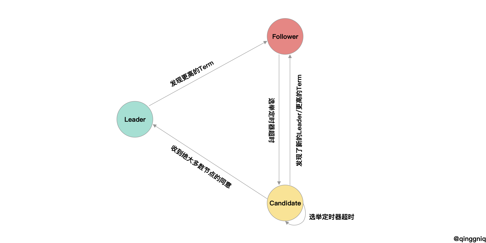
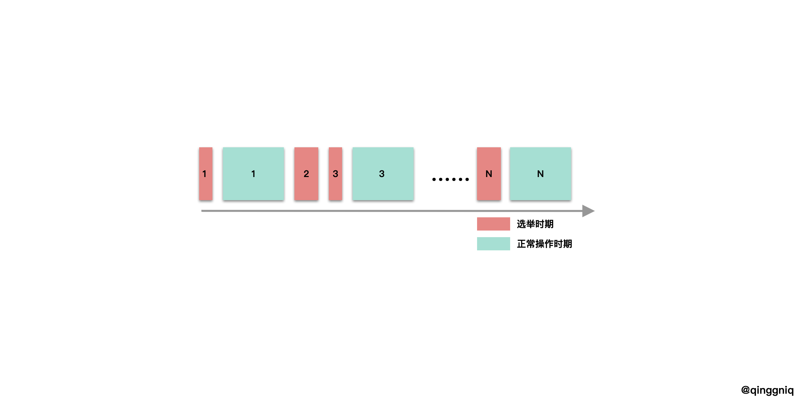

# Raft共识算法

[toc]

## 共识场景

### 单机条件下的一致性问题[^1]


如上图，一个客户端向一个节点发送更新读取请求，如果服务器是**单线程**处理请求，那么单机环境下的强一致性很好解决，每个用户总是能读取到*请求到达时的最新的数据​*。

### 多机下的一致性问题

而在单机服务的致命弱点在于无法提供**容错性**，如果节点挂掉，那么服务就不可用，所以一般情况下一个服务（比如数据库）都会加上一个从服务器，在主服务器挂掉的时候提升为主节点继续提供服务。

上图是一个典型的主-从服务架构，客户端向主节点发出请求，主节点同步的复制写请求到从节点上，主节点**收到从节点写入成功的响应后**再响应客户端写入成功。一切看似很美好，然而主从节点网络发生中断的时候就必须面临**可用性**和**一致性**的抉择了。


如上图，如果主节点和从节点的网络断开，此时客户端向主节点发出写请求，那么根据主节点的行为可以分为两种情况：

1. *主节点返回写入成功*。这样提供了**可用性**，但由于网络断开，所以从节点是没有收到同步请求的，那么客户端在收到写成功的响应后再执行读取的话，从节点返回的就不是最新的值，这样就失去了**一致性**。
2. *主节点停止响应*。在网络恢复之前主节点决定不响应客户写请求，这样客户读的总是最新的数据，保证了数据的**一致性**（所有的写操作失败，自然会读到“最新”的数据），然而却失去了**可用性**。

以上的情况也正是是[CAP理论](https://en.wikipedia.org/wiki/CAP_theorem)的内容[^2]——在网络分区的情况下在**一致性和可用性不可兼得**。

### 加上容错的强一致性模型

可以看到，简单的主从模型并不能在拥有**一致性**的情况下保证**可用性**。根据失效节点类型可以分为两种情况：

1. *从节点失效*。这种情况下主节点可以继续执行写操作，同时兼顾读操作，只要主节点不失效，那么从节点无论失效多少个，集群依然能够提供**一致性和可用性**。
2. *主节点失效*。这种情况下，普通的主从复制模型并没有很好的办法，如何判断主节点失效、如何选取主节点、如何确保选取的新主节点能让系统保证**一致性**，这些问题在普通的主从复制中没有很好的答案。

所以，普通的主从复制模型只能在没有网络分区的情况保证一致性的情况下提供**从节点失效的容错性**，而主节点失效会直接导致系统瘫痪。也就是说，如果能够解决主节点失效的问题，我们就可以拥有**带容错的一致性系统**。

选取主节点是一个**共识问题**——*所有节点就“谁是主节点”达成共识*。选主这个问题可以分解为以下的几个问题：

- 如何判断主节点失效
- 如何选取主节点（主节点需要满足什么条件）
- 为了实现自动选举主节点，在正常的复制流程中需要加入什么样的变化（[这篇总结]([https://qinggniq.com/2019/11/11/DDIA%E8%AF%BB%E4%B9%A6%E7%AC%94%E8%AE%B0%E2%80%94%E2%80%94%E7%AC%AC%E5%85%AB%E7%AB%A0-%E5%88%86%E5%B8%83%E5%BC%8F%E7%B3%BB%E7%BB%9F%E7%9A%84%E6%8C%91%E6%88%98/](https://qinggniq.com/2019/11/11/DDIA读书笔记——第八章-分布式系统的挑战/))提到的在分布式场景中可能出现的两种问题**不可靠的时钟**和**不可靠的网络**，消息可能错发，可能重发，如何避免这些问题）

解决这类**共识问题**的算法叫做**共识算法**，[Raft](https://en.wikipedia.org/wiki/Raft_(computer_science))便是其中一种。

## Raft算法[^3]

**Raft**算法被提出的动机是提出一种**易于理解**的**共识算法**。**易于理解**是相对于[**Paxos算法**](https://en.wikipedia.org/wiki/Paxos_(computer_science))来说的。

### 概述

**Raft**通过选出一个**Leader**，客户端的所有命令都需要直接或间接地发送到**Leader**，**Leader**负责管理命令的顺序，并且将这些命令写到日志里面，并且发送给其他节点使集群节点中的日志达成一致。

开始的时候集群中不存在**Leader**，集群需要自行选举出**Leader**，选举出**Leader**之后，**Leader**需要通过心跳来保持**Leader**的权威性，其他节点也是通过心跳来确定当前集群中的**Leader**是否存活，如果一定时间收不到**Leader**的心跳，那么这个节点就需要开始选举过程来确定新的**Leader**；除此之外，**Leader**同时需要负责接受客户端的请求，确定请求的顺序，并且同步给其他节点，通过节点的回复确定哪些命令可以被**提交**。

所以，Raft的核心部分包括三个个部分：

1. *选举*：选取集群中的主节点的步骤

2. *日志复制*：客户端发送命令给主节点、主节点发送日志给从节点期间的步骤

3. *安全性*：**Raft**算法在执行的过程中有很多特性必须一直保证，*安全性*就是在不同的情况下**Raft**算法可以一直保证这些特性，这些特性也是**Raft**算法能够在不可靠的分布式系统环境中实现正确的共识的原因，保证这些性质也降低了**Raft**算法的复杂度。在**Raft**算法中，必须保证的特性如下：

   | 特性               | 解释                                                         |
   | ------------------ | ------------------------------------------------------------ |
   | *选举安全特性*     | 对于一个给定的任期号，最多只会有一个领导人被选举出来         |
   | *领导人只附加原则* | 领导人绝对不会删除或者覆盖自己的日志，只会增加               |
   | *日志匹配原则*     | 如果两个日志在相同的索引位置的日志条目的任期号相同，那么我们就认为这个日志从头到这个索引位置之间全部完全相同 |
   | *领导人完全特性*   | 如果某个日志条目在某个任期号中已经被提交，那么这个条目必然出现在更大任期号的所有领导人中 |
   | *状态机安全特性*   | 如果一个领导人已经将给定的索引值位置的日志条目应用到状态机中，那么其他任何的服务器在这个索引位置不会应用一个不同的日志 |

### Raft基础

直观的看**选举**和**日志复制**两个过程需要四种消息格式：

- *请求投票*：节点想要竞选主节点，就要发送其他节点“请求投票”消息来获得其他节点的支持
- *投票响应*：这个节点想要获得我的选票，我同意还是拒绝，作为“请求投票”消息的响应
- *日志复制*：成为主节点后，客户端发给主节点命令，主节点需要发送“日志复制”消息来同步日志
- *复制响应*：作为*日志复制*消息的响应

### 选举

**Raft**将节点分成了三种不同的角色，分别是**Leader**、**Candidate**和**Follower**，通常情况下一个集群里面只有一个**Leader**和其他的**Follower**，只有在**选举**的时候才会出现**Candidate**。



**Raft**把时间通过一次次**选举**划分为不同的`Term`（任期），每次选举都会使`Term`增加，如果选举出`Term`，那么**Leader**将会在这个`Term`期间管理整个集群，而如果**选举**没有选出**Leader**那么这个`Term`也会因为没有**Leader**而结束。

下面我们以三个不同状态的节点的伪代码来解释状态转移过程（在下面的伪代码中，会忽略除了选举过程的其他处理）：

#### Follower处理流程

```go
//state Follower
开启一个随机定时器
重置投票状态
for {
  if 超时 {
    Term++
    成为 Candidate
  }
  if 收到其他节点的消息 {
    if Term更大 {
      更新Term
      清除投票状态
    }
    if 是Candidate的“请求投票”的消息 {
      if 消息的term更小 {
        返回失败
      }
      重置定时器
      if 已经投过票了并且不是对方 或者 对方的日志比自己旧 {
        返回拒绝
      }else{
        返回同意
      }
    }
  }
}
```

随机定时器的目的是使得在一个选举流程里面尽量不要出现多个节点同时竞选的情况出现（具体的超时原则将会在安全性中解释）。

#### Candidate处理流程

```go
// state Candidate
重置定时器
投票给自己
开启随机的选举定时器
for {
  发给所有节点“请求投票”消息
  if 超时 {
    Term++
    成为 Candidate
  }
  if 收到其他节点的消息 {
    if 是新Leader的心跳 或者 消息的Term更大 {
      成为 Follower
    }
    if 是“请求投票”的响应 并且 获得了大多数节点的同意 {
    	成为 Leader
  	}
  }
}
```

> 15:   if 是“请求投票”的响应 并且 获得了大多数节点的同意 

根据这条选举的约束，Raft确保了再给定的任期里面最多只有一个**Leader**可以被选出来（选举安全特性）。

#### Leader处理流程

```go
//state Leader
开启心跳定时器
发送心跳给其他节点
for {
  if 超时 {
    发送心跳给其他节点
  }
  if 收到消息 {
    if 消息的Term更大 {
      成为 Follower
    }
  }
}
```

可以看到`Term`使**Leader**转化到**Follower**、**Candidate**转化到**Follower**的关键。`Term`类似于逻辑时钟，落后的`Term`也通常意味着这个节点有可能被网络分区了，因为在正常的处理过程中，**Leader**和**Follower**会交换`Term`，把自己的`Term`更新为更大值，一个**Leader**收到其他节点`Term`更大的消息通常意味着这个**Leader**被隔离很久之后又重新连回集群，这样的**Leader**通常意味着更落后的日志，需要将其变为**Follower**，再通过新**Leader**追回落后的日志。

### 日志复制

选出**Leader**之后，**Leader**需要负责处理客户端的消息、管理与其他节点的同步。

#### 日志格式

在不稳定的网络环境中，消息乱序，重发[^5]是很常见的事情，如果使用普通日志格式（无其他信息的命令序列），那么从节点无法保证接收到的从**Leader**发过来的日志和**Leader**本身存储的日志顺序是否一致，所以需要在日志中添加一些额外的信息。


如上图，**Raft**的日志中添加了`Term`和`LogIndex`两个信息， `Term`用来标识这条日志产生在哪个任期，由于一个任期最多只有一个**Leader**，所以不同`Term`的日志代表着不同时期的**Leader**产生的日志，`Term`越大，这条日志的越新；`LogIndex` 用来标识日志的顺序，根据*领导人只附加原则*可以知道相同`Term`的情况下`LogIndex`越大说明这个日志越新。

> ```go
> 19:  if 已经投过票了并且不是对方 或者 对方的日志比自己旧 {
> ```

而在**选举**流程中**Follower**根据**Candidate**发过来的*请求投票*中的信息就是通过**Candiate的最后一条日志项的Term和LogIndex和自己最后一条日志项比较**来确定新旧的。

在知道了日志格式之后，我们再看看**Leader**和**Follower**是如何处理日志复制的过程的。

#### Leader

```go
初始化心跳定时器
初始化其他节点的“复制进度”信息
for {
  把没有应用到状态机的日志应用，直到遇到没有提交的日志项
  if 心跳定时器超时 {
    给其他节点发送心跳
  }
  if 收到客户端的消息 {
    把消息封装为日志格式
    给其他节点发送“日志复制”消息
  }
  if 收到其他节点消息 {
    if 消息的Term更大 {
      更新 Term
      成为 Follower							 
    }
    if 是“复制响应” {
      if 复制成功 并且 成功的节点数大于一半 并且 复制成功的日志Term为当前Term{
        提交这条日志项
        更新这个节点的“复制进度”信息 //nextIndex更新
      }
      if 复制失败 {
        更新这个节点的“复制进度”信息	//nextIndex--
      }
    }
  }
}
```


关于`复制进度`，如上图显示，由于不同节点的日志状态可能由于网络延迟等原因处于不同的状态，所以**Leader**需要维护各个节点日志的信息避免全量复制，只发送节点需要的日志。而在**Raft**算法中是通过为每个节点维护两个信息来实现`复制进度的`：

- `matchIndex`：**Leader**已经复制给这个节点的Log日志结束索引号
- `nextIndex`：**Leader**需要发送给这个节点的Log日志开始索引号


对于上图的**Leader**来说，下面的**Follower应当的**的`matchIndex`为5，`nextIndex`为6。（然而一开始的时候**Leader**可能不知道最合适的`nextIndex`是多少，所以需要根据**Follower**的响应来调整`matchIndex`和`nextIndex`）。

#### Follower

```go
初始化随机选举定时器
for {
  把没有应用到状态机的日志应用，直到遇到没有提交的日志项
  if 选举定时器超时 {
    Term++
    成为 Candidate 	//进入选举流程
  }
  if 收到Leader的“复制日志” {
    if 消息Term更小 {
      返回复制失败
    }
    根据Leader发送的commitedIndex提交位置和本身的commitedIndex更新commitedIndex //①
    if 日志匹配  { //②
      把最开始匹配的日志替换为Leader发过来的日志    //③
      返回复制成功
    }else{
      返回复制失败
    }
  }
}
```

注意到**Follower**处理的三个关键的地方，

**根据Leader的committedIndex更新committedIndex**

**①**：一个是需要根据**Leader**发给自己的日志提交索引号更新自己的提交索引号（**提交**意味着这个被提交的日志项可以安全的被应用到机器上（类似于数据库中先写日志再写实际数据的感觉））。这是由于**只有Leader才能判断一个日志项能否被提交**，在**Leader**更新了提交索引号之后，**Follower**需要通过**Leader**的“日志复制”消息中捎带的提交索引号得知哪些日志需要被提交。

**一致性检查**

**②**：只有**Leader**发送的日志和自己对应的日志项匹配才会复制**Leader**发送的日志。在**Follower处理流程**中我们知道**Leader**会根据`nextIndex`发送相应的日志项，**Leader**在发送日志的同时会附带`nextIndex-1`处的日志项的`LogIndex`和`Term`用来指导**日志匹配**，只有在**nextIndex-1处的Term相同**才意味着日志匹配，这是*日志匹配原则*的内容（如果两个日志在相同的`LogIndex`（索引位置）的日志条目的`Term`（任期号）相同，那么我们就认为这个日志从头到这个索引位置之间全部完全相同），而这个*日志匹配原则*包含了两个约定：

- 如果两个日志项的`Term`和`LogIndex`相同， 那么它们存储着相同的命令；
- 如果两个日志的某个位置上日志项的`Term`和`LogIndex`相同，那么这个位置之前的日志项也相同。

第一个约定可以根据*领导人只附加原则*获得，**Leader**最多在一个任期里面的指定位置创建一条日志，而这些日志一旦创建，那么就永远不会改变。

第二个约定类似于归纳法，

```markdown
**起始步骤**：

​	初始的时候两个日志里面没有日志项，自然满足这个约定；

**递推步骤**：

​	假设在两个日志长度为$N$的时候满足约定，那么在**Leader**添加第$N+1$条日志项的时候，**Follower**只有“日志匹配”的时候（也就是第$N$条日志相同的时候 ）才会同意复制第$N+1$条日志项，所以在第$N+1$添加成功的时候，日志的两部分都相同：

- `log[0:N]`，因为递推条件，两个日志相同
- `log[N+1]`，由于日志都是由**Leader**产生，所以相同

所以在两个日志长度为$N$的时候满足约定时，通过“日志匹配”步骤添加第$N+1$条日志项的日志也满足约定。
```

这个*日志匹配*的步骤也叫做*一致性检查*。

**Follower日志覆盖**

**③**:在正常的日志复制过程中，我们可以想像**Follower**的日志一定会匹配，并且只会出现追加的情况，**Leader**和**Follower**不会出现不一致的情况（就是同一个`LogIndex`有着不同的`Term`值），但是出现了**Leader**崩溃之后因为不同节点的复制进度不一样，新的**Leader**新添加的日志可能就会和其他节点因为**旧Leader同步但是没有提交的日志**冲突，就会出现这样不一致的情况，那么如何处理这些与**Leader**冲突的日志是需要仔细考虑的事情。


上图忽略日志中的命令，方格中的数字代表日志的`Term`。最上面的一行是此时**Leader**的日志，而下面是**Follower**六个可能的的日志。

- (a)：**Leader**尚未把最新的日志发给这个**Follower**
- (b):  这个节点在任期为4的时候被网络分区了/挂了
- (c):  任期为6的**Leader**复制了最新的消息到(c)，而没有复制到现在的**Leader**上，并且没有提交，现在的**Leader**竞选竞选成功
- (d): 这个节点在任期为7的时候竞选成功，客户端发送了两个命令，但是还没来得及同步日志到其他节点就崩溃了
- (e): 这个节点任期为4的时候是**Leader**，在发送了两条日志之后挂了
- (f): 这个节点在任期为2的时候是**Leader**，但是尚未同步日志到其他节点就挂了，很快又重启了，并且在任期为3的时候又竞选成功为**Leader**，同时又收到了客户端的消息，在同步给其他节点之前又挂了

**Leader**需要通过调整节点的`复制状态`（也就是`nextIndex`的值），通过**Follower**返回的“匹配成功”与否的回复来探测**Leader**与**Follower**最后一个匹配的日志项，**Leader**会将这之后的日志同步到节点，而**Follower**本身存在的那些和**Leader**不匹配的日志记录将会被**Leader**的日志覆盖，这样就可以让**Follower**节点的日志和**Leader**的节点保持一致。

### 安全性

以上说明了**选举**和**日志复制**在每个角色中的不同处理，但是**Raft**算法的**安全性**并不能很直观的看出来，其中有些细节需要讨论：

- **Candidate**需要满足什么条件才有资格被选举为**Leader**？

  我们在**选举**的**Follower**的伪代码中看到

  > ```go
  > 19:  if 已经投过票了并且不是对方 或者 对方的日志比自己旧 {
  > 20:			拒绝
  > 21:  }
  > ```

  这样的处理流程，**Follower**根据自己的投票状态和对方的日志状态来决定是否投票给这个**Candidate**，前一个条件很好理解，一个**Follower**只能投票给一个**Candidate**，后一个条件看似很直观，但是这样的判断条件

  > 如何保证一个**Leader**被选举之后的复制操作不会导致“**Follower**覆盖掉**已提交**的日志” 

  由**Follower在日志复制中的处理流程**我们知道**Follower**只会覆盖那些和**Leader**冲突的日志，所以上面的问题可以转换为这样

  > 如何保证被选出来的**Leader**拥有所有被提交过的日志【领导人完全特性】

  **Follower**通过判断日志的新旧的投票规则如何保证上述的特性是需要讨论的问题

- **Leader**如何确定一个日志项可以被标志为**已提交**？

  根据*Leader*的处理流程，以下是判断日志项可以被提交的条件

  > ```go
  > 16: if 复制成功 并且 成功的节点数大于一半 并且 复制成功的日志Term为当前Term{
  > 17:     提交这条日志项
  > 18:     更新这个节点的“复制进度”信息 //nextIndex更新
  > 19: }
  > ```

  那么为什么要有`复制成功的日志为当前Term`这个条件，没有这个条件会如何？

- 之前提到过的选举定时器超时时间的选择，可不可能出现在有节点满足条件下，依旧永远选不出来**Leader**的情况发生？

#### 领导人完全特性论证

在**Raft**中有两个地方需要*大多数节点同意*

- **Candidate**竞选**Leader**
- **Leader**提交日志

**Candidate竞选Leader**

在这个过程中，我们可以推出这样的事实：

****

(**Follower**只会投票给日志至少比自己新的**Candidate** $\and$ **Candidate**需要获得集群中绝大多数节点的同意才能成为**Leader**) $\implies$ “新**Leader**的日志至少比集群中绝大多数节点新”

****

**Leader提交日志**

在这个过程中，我们可以推出这样的事实：

****

**Leader**需要绝大多数节点复制成功才能被标志日志为提交 $\implies$ “拥有所有提交日志的节点占大多数”

****

然后，根据这两个事实

-  “新**Leader**的日志至少比集群中绝大多数节点新”
-  “拥有所有提交日志的节点占大多数”

我们其实就可以得出*领导人完全特性*了，因为**Leader**必然是从“拥有所有提交日志的节点”中选出来的，否则无法达成“至少比绝大多数节点的日志新”的事实。更精确的论证如下：

通过反证法假设*领导人完全特性*不存在，推出矛盾，证明*领导人完全特性*存在：


如上图（任期U>任期T），在任期T时候**S1**为**Leader**，给**S2**、**S3**、发送了“日志复制”消息并且提交成功（获得了**S1,S2,S3**的同意），之后在任期U的时候**S5**竞选**Leader**成功（获得了**S3,S4,S5**的同意）。

假设：任期U的**Leader S5**是第一个没有任期T的**Leader S1**提交的日志的**Leader**，设那条日志为`Log A`。

- 根据*领导人只追加原则*可知在**S5**竞选的时候没有`Log A`
- 根据“ **Candidate**需要获得集群中绝大多数节点的同意才能成为**Leader**”和“**Leader**需要绝大多数节点复制成功才能被标志日志为提交 ”可知必定有一个节点**即拥有S1的`Log A`，又投票给S5**。假设这个节点就是上图的**S3**。
- **S3**必然在**S5**发送“请求投票”之前接受了**S1**的“复制日志”消息，否则会因为任期U比任期T大的原因返回**S1**拒绝复制的消息。
- 下面分情况讨论投票时**S5**最后一条日志的不同情况：
  - 如果**S5**的最后一条日志的`Term`小于`S3`最后一条日志的`Term`，根据“**Follower**只会投票给日志至少比自己新的**Candidate**”的事实，**S5**的日志至少要比**S3**新，矛盾。
  - 如果**S5**的最后一条日志的`Term`和**S3**的`Term`相同，那么**S5**的日志至少和**S3**一样长，**S3**包含`Log A`，那么**S5**也包含`Log A`，矛盾。
  - 如果**S5**的最后一条日志的`Term`比**S3**的`Term`大，假设这条日志为`Log B`，那么它的`Term`一定比T大，说明在任期T和任期U之间有一个任期V（T < V < U）的**Leader**复制日志到**S5**上，而那个**Leader**的日志必然有`Log A`（假设的条件是“任期U的**Leader S5**是第一个没有`Log A`的**Leader：**”），而**S5**没有，根据*日志匹配原则*，`Log B`不可能被复制到**S5**中，矛盾。
- 综上所述，*领导人完全特性*存在。

#### 当前任期之前的日志条目

再来回顾一下*Leader在复制日志的时候的处理流程*：

> ```go
> 16: if 复制成功 并且 成功的节点数大于一半 并且 复制成功的日志Term为当前Term{
> 17:     提交这条日志项
> 18:     更新这个节点的“复制进度”信息 //nextIndex更新
> 19: }
> ```

我们看看如果**Leader**可以提交非当前`Term`的日志会发生什么：


上图是随着任期变化的各个节点的日志的状态变化，其中**(a), (b), (c)**是正常处理流程下的日志情况，而**(d), (e)**分别代表**(c)**在“允许**Leader**提交非当前任期日志”和“不允许**Leader**提交当非当前任期日志”的不同情况下形成的日志状态，其中红色阴影的日志代表所属的节点为该任期的**Leader**。

****

 (a)：任期为2，**S1**是**Leader**，部分复制了索引位置 2 的日志项。

 (b)：任期为3，**S1** 崩溃了，然后 **S5** 在任期 3 里通过 **S3**、**S4** 和自己的选票赢得选举，然后从客户端接收了一条不一样的日志条目放在了索引 2 处。

 (c)：任期为4，**S5** 崩溃了；**S1** 重新启动，选举成功，开始复制日志。此时来自任期 2 的那条日志已经被复制到了集群中的大多数机器上。

** **

如果“允许**Leader**提交非当前任期日志”，把**S1**中任期为2的日志标志为**提交**，那么出现(d)的情况：

(d)：任期为5，**S1**又崩溃了，**S5** 可以重新被选举成功（通过来自 **S2**，**S3** 和**S4** 的选票），然后覆盖了他们在索引 2 处的日志。这样就导致被标志为**提交**的日志被覆盖，破坏一致性。

****

反之，如果“不允许**Leader**提交当非当前任期日志”，类似于(e)的场景，S1 把自己主导的新任期里产生的日志条目复制到了大多数机器上，然后标志为**提交**：

(e)：任期为4，那么在后面任期里面这些新的日志条目就会被提交（因为 S5 就不可能选举成功）。 这样在同一时刻就同时保证了，之前的所有老的日志条目就会被提交。

****

#### 时间问题

在**选举**、**日志复制**的过程中涉及到了三个时间：

- *选举定时器超时时间(electionTimeout)*：超过这个时间**Candidate/Follower**[重新]开始选举。
- *心跳定时器超时时间*(heartbeatTimeout)：超过这个时间**Leader**发送心跳到其他节点。
- *网络通信时间(broadcastTime)*：**Leader**发送给**Follower**消息并收到回复的平均往返时间。

在**Raft**算法中要求

$$broadcastTime << electionTimeout << MTBF$$。

其中$MTBF$指单个节点发生故障的平均间隔时间，**Raft**要求*网络通信时间*要比*选举定时器超时时间*小一个数量级，这样可以保证在**Leader**可以发送心跳的间隔里节点不会因为选举定时器超时而发起**选举**；同时**Raft**要求$MTBF$比*选举定时器超时时间*大一个数量级，因为一般集群只有在**选举**的时候**不可用**，也就是会有*选举定时器超时时间*的不可用的时间，如果这个时间和$MTBF$相近，那么这个共识算法就没有什么意义了。同时**Raft**让*选举定时器超时时间*随机是为了避免多个节点同时**选举**的情况发生。**Raft**算法并未规定*心跳定时器超时时间*，这个超时时间一般比选举定时器小几倍，这样给网络通信时间留有余地。

### Raft基础总结

下面是Raft论文中的浓缩总结。


## Raft扩展

**Raft**扩展包括**成员变化扩展**和**日志压缩扩展**，前者是为了处理“新添加节点到集群”、“从集群删除节点”两个事件的方法，后者是为了处理“日志过大导致OOM”的情况的方法。

### 成员变化

成员变化最简单的解决办法就是在更改集群成员的时候下线整个集群，然后重新启动，但是这样会导致至少一个*选举超时时间*的时间段集群不可用，所以**Raft**决定将自动更改成员配置纳入到算法中。

为了让更改时期安全性得到保证，就必须不能让集群在一个任期选举出两个**Leader**，但是如果直接添加节点就可能会出现下面的情况。


如上图，每个节点都会在某个时间点感知到成员的变化，在图中那个时间点就是颜色变化的分界线，绿色代表还是原来集群中只有三个节点的配置，红色代表现在集群中有五个节点的配置，那么如果在黑色方框的那个时间段开始了**选举**，旧配置的节点以为集群中只有三个节点于是**S1**获得了**S1, S2**的投票成为了**Leader**，于此同时，**S5**开始竞选，如果**S3**此时的日志很落后，那么**S3**就有可能投票给它，这样**S5**获得了**S3, S4, S5**的投票，成为了**Leader**，这个时候集群中出现了两个**Leader**，违背了*领导人唯一*原则。

而**Raft**作者认为添加节点成员会出现安全性问题的根本原因在于一次性加入多个节点，所以**Raft**限制一次只能添加/删除一个节点到集群中，这样没有安全性问题并且多个节点的添加/删除也是可以由一个个的添加/删除去实现。


上图是从节点数为奇数/偶数的集群中添加/删除一个节点的示意图，黄色区域里面的节点的配置都是旧配置，而红色节点的配置都是新配置，可以看到不管如何，在配置更改的时候不可能发生*两个配置下的“大多数”同时出现*的情况。证明

设$Majority(N)$为$N$个节点的“大多数”节点数，$N = 2 \times M$的时候$Majority(N)= M + 1$，当$N = 2 \times M + 1$的时候$Majority(N) = M + 1$，

- (a)：给一个奇数节点数$N$的集群添加节点，且$N = 2 \times M + 1$
  - 新配置的$Majority(N+1) = Majority(2 \times M + 2) = M + 1 + 1 = M + 2$，
  - 旧配置的$Majority(N) = Majority(2 \times M + 1) = M + 1$，
  - 此时节点数为$N + 1 = 2 \times M + 2$，而此时新配置和旧配置的*Majority*和为$2 \times M + 3$，大于节集群节点数，所以不可能出现*两个配置下的“大多数”同时出现*的情况。
- (b)、(c)、(d)的证明和(a)类似。

不可能发生*两个配置下的“大多数”同时出现*的情况也意味着在成员配置变化的时候不可能出现两个**Leader**。

**Raft**在成员配置的时候会通告**Leader**一个“成员变更”消息，**Leader**把这个消息作为一种特殊的日志项同步到其他节点，所以**Raft**的成员配置不会破坏之前的处理流程，在成员变化的时候依然可以处理客户请求。

具体的处理流程如下：

**对于Leader**

- 成员配置更改信息（假设为$C_{new}$）首先发送给**Leader**
- **Leader**收到成员配置更改信息后，将$C_{new}$作为一条日志以日志复制的形式发送给其他节点，并且以新的配置继续运行
- 一旦大多数的节点返回配置更改成功，意味着那些旧配置的节点不能能组成“大多数”来**竞选Leader**了。

**对于Follower**

- **Follower**收到这个“配置更改”消息后，一旦通过“一致性检查”，添加到本地日志后，就开始使用$C_{new}$作为当前的配置

一旦“配置更改”日志项被标志为**提交**那么：

- **Leader**可以向外公告成员配置更改成功
- 如果是“移除节点”的“配置更更改”，那么此时这个被移除的节点可以停机了
- 可以开始下一个“成员配置更改”了，如果是在这之前的时间进行一个新的配置更改，那么就可能发生上面图一个集群两个**Leader**的情况了

值得注意的是，不管新的配置是不是被提交了，节点总是使用新的配置。这样就可以加快两个“配置更改”操作的时间间隔了。假使每个节点都是在在**Leader**决定这个“配置更改”被提交之后再去应用这个新的配置，那么首先**Leader**需要时间去统计集群中大多数节点的同意才能标志为**提交**，其次决定将“配置更改”设置为**提交**之后还需要一个*广播时间*，之后集群中的其他节点才能知道“配置更改”是不是被提交了，这个时间是不必要的。**但是这样的决策并不意味着“配置更改”日志可以被覆盖掉（如果发生Leader的更改），所以系统需要做好回滚到之前配置的准备。**

并且在处理的过程中，**Follower**不会无视处于旧配置节点的“日志复制”和“请求投票”信息，具体原因详见**Raft**大论文[^6]。

除此之外，**Raft**还添加了一些额外的优化来处理在集群添加的过程中可能会出现的问题：

#### 可用性

配置更改会导致一些破坏集群**可用性**的事情发生。


如上图：

- (a)：向一个3节点集群中添加一个节点之后原有节点挂掉了一个，这个时候如果**Leader**发起“日志复制”，那么新的日志复制将很难获得大多数节点的同意，因为**S3**不可用、**S4**此时的日志落后太多，而**S1, S2**两个节点构成不了集群的“大多数”，所以集群陷入了“不可用”状态，直到**S3**恢复，或者**S4**追赶上日志集群才能可用。
- (b)：向一个3节点集群中快速添加了三个节点，此时的*Majority*变成了4，所以和(a)类似，系统处于了“不可用”状态。

可以看到两种情况都是因为新加入的节点日志进度太落后造成集群无法提交新日志，所以**Raft**引入了**Learner**新的角色来解决这个问题：

- **Learner**只接收**Leader**的日志同步消息，它无法投票，并且**Leader**在决定日志提交和**Candidate**统计投票的时候不把它计入到集群成员计算*Majority*。在**Learner**追上**Leader**的日志进度之后，就转为正常的**Follower**。

决定何时将**Learner**转换为**Follower**是个问题，太快的话就无法可能会出现上图的情况，最好的时机就是让*不可用*的时间控制在一个*选举超时时间之内*（客户端那边的设计应当允许因为**Leader**失效而**选举**导致的不可用的情况发生），并且**Leader**需要适时放弃添加节点，如果这个节点不可用或者追赶太慢的**Learner**（注意，这里的**Learner**处理和普通的“日志复制”不一样，**Follower**在崩溃后**Leader**不会放弃发送“日志复制”请求给**Follower**，而是不断重试），通常添加一个不可用的节点总是错误的决定[^7]。

**Raft**将追赶过程划分为*round*（轮次），**Leader**在一个轮次内复制上一轮结束的日志之后的所有日志到**Learner**上，*round*为1的时候就是复制当前**Leader**上所有的日志。


如上图，*round*2的时候**Leader**把*round 1*时收到的日志全部发给**Learner**，当**Learner**把当前*round*的所有日志都复制成功，*round*结束，开启下一个*round*。一般**Learner**会追赶固定数目的*round*（比如10轮），如果最后一次*round*的持续时间小于**选举超时时间**，那么这个**Learner**就可以加入到集群成为**Follower**了，而如果最后一轮*round*大于这个时间的话，**Leader**就会放弃这次“成员配置更改”。

#### 移除当前Leader

当需要下线当前集群的**Leader**节点时，**Leader**节点将发出一个变更节点配置的命令，只有在该命令被提交之后，原先的**Leader**节点才下线，然后集群会自然有一个节点选举超时而进行新的一轮选举。

#### 移除的节点对集群的扰乱

移除一个不在$C_{new}$中的节点可能会出现问题，这些服务器将不会再接收到心跳，所以当选举超时，他们就会进行新的选举过程。他们会发送拥有新的任期号的“请求投票 ”，这样会使集群中其他还未收到$C_{new}$配置消息的节点`Term`更改，这些节点再和现在的**Leader**通信的时候就会当前的**Leader**回退成**Follower**。新的**Leader**最终会被选出来，但是被移除的服务器将会再次超时，然后这个过程会再次重复，导致整体可用性大幅降低。

解决办法就是修改**Follower**处理“请求投票”消息流程，如果确定当前的**Leader**存在，那么即使碰到`Term`更大的“请求投票”消息，也不会更新自己的`Term`。而判断当前节点的方式就是判断这条“请求投票”消息和最近一次的“心跳”消息的时间间隔是否大于最小的选举时间。

#### 一次更改多个成员配置的方法

一次改变一个成员配置的方法是**Raft**大论文中[^6]提出的，在此之前**Raft**使用的是一种更为复杂的成员配置更改方案，它同样可以在进行成员配置更改的时候处理客户端的请求，缺点是增加了复杂度，优点是可以一次添加/删除多个节点。

为了保证安全性，配置更改必须使用两阶段方法。目前有很多种两阶段的实现。例如，有些系统在第一阶段停掉旧的配置所以集群就不能处理客户端请求；然后在第二阶段在启用新的配置。在**Raft**中，集群先切换到一个过渡的配置，我们称之为*共同一致*；一旦*共同一致*已经被提交了，那么系统就切换到新的配置上。*共同一致*是老配置和新配置的结合：

- 日志条目被复制给集群中新、老配置的所有服务器。
- 新、旧配置的服务器都可以成为领导人。
- 达成一致（针对选举和提交）需要**同时在两种配置上**获得大多数的支持。


如上图，集群配置更改的消息将会以一种特殊的日志项存储通信，上图展示了配置转化的过程。

在初始的时候

- **Leader**收到配置更改请求（从$C_{old}$更改为$C_{new}$ ），它会创建一个$C_{old,new}$日志项同步给其他的节点
- 其他节点收到$C_{old, new}$之后，就立刻使用$C_{old, new}$作为新的配置直接生效，无论它是不是被提交，同时**Leader**也需要用$C_{old, new}$配置来决定$C_{old, new}$的日志项是否被提交（就是需要同时获得$C_{new}$配置下的大多数和$C_{old}$下的大多数节点同意）
- 当**Leader**崩溃，这个时候新选出来的**Leader**要么使用$C_{old}$要么使用$C_{old, new}$作为配置，所以在这个阶段，$C_{new}$配置不可能决定任何东西（**选举**或者**提交**过程）

当$C_{old, new}$被提交的时候，也就是集群中的大多数节点都有$C_{old, new}$配置的时候，没有节点可以仅仅使用$C_{new}$或者$C_{old}$来决定任何东西（比如**选举**），并且根据*领导人完全特性*保证了新的**Leader**必定拥有$C_{old, new}$日志项。这个时候

- **Leader**创建一条$C_{new}$配置更改日志项复制给其他节点，其他节点在收到$C_{new}$日志项的时候就立刻更换为$C_{new}$配置，在$C_{new}$被提交之前如果**Leader**崩溃了，被选出来的**Leader**要么使用$C_{new}$配置，要么使用$C_{old, new}$配置，$C_{old}$配置不可能决定任何东西

通过加入一个新的*共同一致*阶段，**Raft**避免了在一个时期节点通过不同的配置分别达成一致的情况出现，所以不会出现一开始说的加入多个节点导致集群中出现两个**Leader**的状况。

### 日志压缩

在日志复制的过程中，我们需要通过日志来做一致性检查，遍历日志中的命令并把它应用到状态机上，如果日志过长，内存无法装下，会出现可用性问题，这个时候需要持久化来减小日志的内存占用。

简单的方法类似于[Redis4.0](https://github.com/antirez/redis)中的持久化方案，定期做**CHECKPOINT**，**CHECKPOINT**之前的日志删除。


在**Raft**中就会把**提交了**的日志持久化，然后记录这个快照的`LastLogIndex, LastLogTerm`。

## 一些优化

### 选举

#### Pre-Vote

设想这样的情况，少数**Follower**被网络分区，那么它会因为选举定时器超时并且永远无法成为**Leader**而不断的增加`Term`，当网络恢复正常，那么这个**Follower**更高`Term`的“请求投票”消息发给**Leader**后，会造成**Leader**成为**Follower**，照成了集群一个选举时间的不可用。

**Raft**引入**Pre-Vote**阶段来避免被分区的节点`Term`过大的问题，就是在**Follower**的（**Candidate**的选举定时器超时不会有这个阶段）选举定时器超时的时候不会立刻增加`Term`然后发起投票，然而先广播“请求投票”消息，如果收到的回复能够使自己成为**Leader**，那么开始真正的投票，增加`Term`，广播“请求投票”消息。

#### 领导权转移

有的时候我们需要下线**Leader**节点，而直接移除节点会照成一个选举超时时间的不可用状态；有时需要指定一个节点成为**Leader**（原有的**Leader**负载过大、指定的这个节点配置更高等等原因），原有的**Raft**算法无法实现这样的功能。所以**Raft**增加了**Leader Transfer**这个功能。

- **Leader**收到“领导权转移”消息之后，停止接收新的客户请求
- **Leader**复制所有的消息到指定的节点，让这个节点满足*领导人完全特性*
- 复制完成之后，**Leader**发送一个*TimeOut*消息，这会导致这个节点的选举定时器立刻超时，然后开始选举

如果目标节点挂掉，那么就放弃转移；如果领导权转移不能在一个选举时间完成，那么就放弃这次的转移。

注意到之前在**Raft扩展/移除的节点对集群的扰乱**中提到**Follower**会根据是否存在活跃的**Leader**来判断是不是应该无视“请求投票”消息，而这里在**领导权转移**的时候就需要在消息中加入特殊的标志来避免被节点无视了。

### 日志复制

#### nextIndex回退

在日志复制的时候**Leader**会根据“复制响应”成功与否来决定如何更新`nextIndex`，**Raft**最初使用`nextIndex--`作为“复制响应”失败时的更新，然而如果**Leader**日志过长，这样的更新过于缓慢，而且在**成员变化/可用性**提到新加入的节点需要追赶上**Leader**之后才能加入节点，而复制给新节点的操作使用的还是普通的“日志复制”，那么确定*round 0*的起始位置依旧需要**Leader**根据“复制响应”成功与否来决定。这样会导致节点加入集群的时间过长。

**Raft**引入了两个优化：

- 首先**Follower**在日志匹配的判断中，如果匹配失败，那么将会计算出包含冲突的条目的`LogTerm`和自己存储的那个任期的最早的`LogIndex`，然后作为提示返还给**Leader**，**Leader**根据这个提示可以更快地找到最开始的匹配位置
- 接上文，除了返回最早的发生冲突的条目的`LogTerm`和自己存储的那个任期的最早的`LogIndex`外，还会返回日志长度，**Leader**回取这两个的最小值来更新`nextIndex`

### 客户端请求

#### 一致性读

**Raft**算法中，客户端的所有请求都需要大多数的节点获得同意提交后才能返回， 但是对于只读的请求，这样的流程过于缓慢。

但是如果不经过上面的流程，**Leader**节点在收到一个只读请求时就直接将本节点上保存的数据应答客户端，也是不安全的，因为这可能返回已经过期的数据，因为日志提交并不意味着状态机的更新。一方面**Leader**节点可能不再是集群的**Leader**，只是这个节点并不知道；另一方面可能数据也发生了改变。返回过期的数据不符合一致性要求，因此这样的做法也是不允许的。

**Raft**中针对只读请求是这样做处理的：

1. **Leader**节点需要有当前已提交日志的信息。在前面提到过不能提交前面任期的日志条目，因此一个新**Leader**产生之后，需要提交一条空日志，这样来确保上一个任期内的日志全部提交。
2. **Leader**节点保存该只读请求到来时的`committedIndex`为`readIndex`。
3. **Leader**需要确认自己当前还是集群的**Leader**，因为可能会由于有网络分区的原因导致**Leader**已经被隔离出集群而不自知。为了达到这个目的，leader节点将广播一个heartbeat心跳消息给集群中其它节点，当收到半数以上节点的应答时，**Leader**节点知道自己当前还是**Leader**，同时`readIndex`索引也是当前集群日志提交的最大索引。
4. **Leader**等到状态机应用日志到`readIndex`，这样当前的读请求所读到的数据满足一致性
5. 返回响应

这样将有可能多轮的日志复制操作变成了一轮广播的心跳操作，减小了只读请求的响应时间。

## 参考

[^1]: https://en.wikipedia.org/wiki/Consistency_model

[^2]:Seth Gilbert and Nancy Lynch. 2002. Brewer’s conjecture and the feasibility of consistent, available, partition-tolerant web services. SIGACT News 33, 2 (June 2002), 51–59. DOI:https://doi.org/10.1145/564585.564601

[^3]:Diego Ongaro and John Ousterhout. 2014. In search of an understandable consensus algorithm. In Proceedings of the 2014 USENIX conference on USENIX Annual Technical Conference (USENIX ATC’14). USENIX Association, USA, 305–320.

[^4]: https://en.wikipedia.org/wiki/State_machine_replication

[^5]: https://qinggniq.com/2019/11/11/DDIA%E8%AF%BB%E4%B9%A6%E7%AC%94%E8%AE%B0%E2%80%94%E2%80%94%E7%AC%AC%E5%85%AB%E7%AB%A0-%E5%88%86%E5%B8%83%E5%BC%8F%E7%B3%BB%E7%BB%9F%E7%9A%84%E6%8C%91%E6%88%98/

[^6]: https://github.com/ongardie/dissertation

[^7]: Leslie Lamport. 1998. The part-time parliament. ACM Trans. Comput. Syst. 16, 2 (May 1998), 133–169. DOI:https://doi.org/10.1145/279227.279229
[^8]:https://www.codedump.info/post/20180921-raft/
[^9]:https://github.com/maemual/raft-zh_cn/blob/master/raft-zh_cn.md

