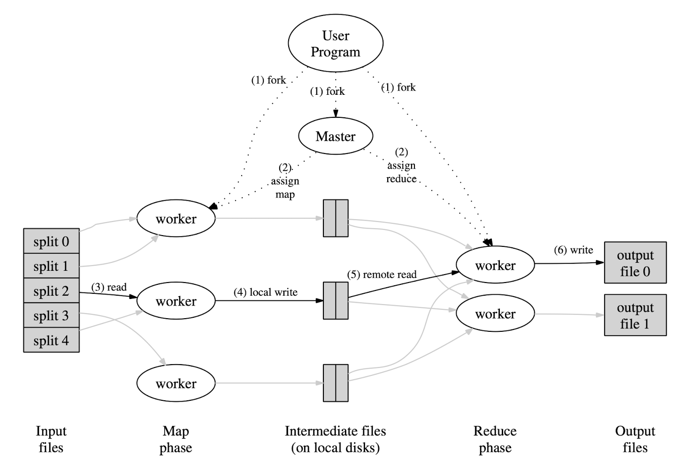

# MapReduce

## 背景

以2004为截止的前五年，Google实现了许多具有特殊目的处理原始数据的程序，比如用于处理网页爬虫，分布式Web日志，许多计算都是很直接的，比如word count，但是输入必须需要从分布式的环境中获取，因为需要并行获取输入数据才能让数据在合理的时间处理，那么如何并行化这些计算、分布化数据、处理分布式系统中的节点失效问题会把本来很简单的计算程序增加许多处理复杂情况的代码，所以亟需一个框架来给程序编写者提供一个好用的编程接口，以屏蔽并行化、分布化、节点失效这些需要负责逻辑来处理的代码，让用户只关系算法本身的实现。于是作者提出了一个新的抽象来表示简单的计算，但是使用程序库隐藏了之前提到的比较麻烦的细节。

## MapReduce是什么

MapReduce 是 Google设计的一种用于大规模数据集的分布式模型，它具有支持并行计算、容错、易使用等特点。它的设计目标如下：

- 支持并行
- 分布式化数据
- 容错
- 易于使用
- 负载均衡

## 编程模型

MapReduce中只有两个阶段：Map阶段和Reduce阶段，这两个阶段的函数都是由用户编写，MapReduce模型规定了两个阶段的输入和输出     。

在 Map 过程中，Map 函数会获取输入的数据，产生一个临时中间值，它是一个 K/V 对，然后MapReduce Library 会按 Key 值给键值对（K/V）分组然后传递给 Reduce 函数。而后，Reduce 接收到了这些 K/V 对，会将它们合并。

| 阶段   | 输入类型       | 输出类型     |
| ------ | -------------- | ------------ |
| map    | (k1, v1)       | list(k2, v2) |
| reduce | (k2, list(v2)) | list(v2)     |


### 例子

以word count（词频统计）这个例子来展示如何用MapReduce编程模型来实现word count这个功能。

```python
map(String key, String Value):
  // key  : file name
  // value: file content
  for each word w in value:
    EmitIntermediate(w, "1")

reduce(String key, Iterator values):
  // key       : a word
  // iterators : a list of counts
  for each v in values:
    result += ParseInt(v)
  Emit(AsString(result))
```

- map函数接受一个文件名和文件内容，然后为每个word生成一个<word, "1">的kv对，
- 然后发送给Reduce，Reduce接受到所有的kv对了之后，就会执行reduce函数，reduce函数接受一个key，和value列表，意思是就收一个key和所有key和它相同的<k, v>键值对，在word count中所有的value都是"1"，在reduce中把所有value想加就是这个word对应的出现次数。

## 执行流程

上一节是算法的逻辑，其中隐藏了很多细节，比如在分布式系统中，map如何把输出发给reduce函数？reduce如何保证能够收到同一个key的所有kv键值对？

首先，在用户程序会开启一个Master进程，这个进程用于协调MapReduce过程，Map阶段的调用是分布在不同的机器上，不同的机器自然的将数据划分为M个，假设Reduce执行的机器有R个，那么Master将会把Map阶段执行的结果根据映射关系（比如hash(key)%R）发送到对应的执行reduce过程的机器上，保证同一个key的values会被同一个reduce过程处理

以下是Google MapReduce的执行流程概述图：



具体流程如下：

1. 由用户程序中调用的 MapReduce Library 将文件分成 M 块（M 要远大于 Map Worker 的数量，每块大小16MB~64MB），此时，进入 MapReduce 过程；
2. 由 Master 给空闲的 Worker 分配任务，共有 M 个 Map 任务，R 个 Reduce 任务；
3. Map Worker 读取文件，将文件处理为 K/V 键值对，K/V 键值对缓存于内存中；
4. 将缓存于内存的 K/V 键值对写入磁盘，分成 R 堆，然后将结果发送给 Master；
5. Master 将这些 K/V 键值对的存储地址告知 Reduce，Reduce Worker 通过 RPC（远程过程调用）进行读取，读取完毕之后会根据 Key 值进行排序；
6. Reduce Worker 将已经排序的结果进行遍历，将每个 Key 值所对应的一组 Value，所组成的 `<key, values>`传递给用户所编写的 reduce 函数进行处理；
7. 所有的 Map，Reduce 任务都完成后，告知用户程序，MapReduce 已经结束，返回用户程序。

## 容错问题

以上通过master协调解决了分布式并行处理的问题，但是并没有解决容错的问题，如果一个正在执行Map过程的机器宕机了，那么应该如何处理以保证结果依旧正确就需要合理的失败处理机制了。

首先，考虑到图1，机器一共有两种角色——Master，处于用户程序所在的机器；Worker，执行Map和Reduce过程的机器。下面分情况讨论一下Google 是如何处理不同角色机器失败的情况的。

### work失效

- 失败检测: master 周期性的ping 每个worker。如果没有从worker收到一定数量的回复就会由master将woker标记为失败。

-  失败处理: 

- - 任何由失败woker`完成的map任务`会被重置为等待执行的状态。因此该map任务有资格被调度到其他woker处理。
  - 任何map 或者reduce任务在失败worker上`运行中`的都会被重置为等待执行状态(任务尚未被调度的状态，简单的说就是让这个任务重做)，变得有资格被重新调度。

这里有个细节需要注意,已经完成的reduce任务不需要重置,而已经完成的map任务需要重置主要是因为:

完成的map任务会被重新执行是因为他们的输出是存在失败worker的本地磁盘，因此那些数据是不可被访问的。(而某些reduce任务需要获取这个数据所以要重新执行)完成reduce任务不需要重新执行因为，他们的输出存在了全局文件系统当中。

当一个map任务首先被worker A执行然后由B执行(因为A失败了)，所有在执行reduce任务的worker都会被通知重新执行。任何一个还没有从A读取数据的worker将会从B读取数据。

MapReduce 能够应对大规模worker失失败。MapReduce master 简单的重新执行由那些不可访问机器执行的任务。并且继续向前执行任务，最终完成MapReduce作业。

### Master失效

类似于数据库备份，Master同时也会定期的向磁盘备份数据，如果Master失效了，那么Master就会根据本地最新的检查点重新启动。但是Google具体实现的时候还是直接让客户端重试的。

### 操作幂等性

在分布式环境下，我们不能保证网络会不会发生延迟，重发，这些情况，这样，如果一个Map worker多次发送同一个任务的执行结果，如果多次的操作导致了不同的结果，说明这个操作不符合幂等性，那么就不能保证Map Reduce过程的结果的正确性。Google主要是通过程序某些操作的原子性来保证其幂等性的：

- Map过程时，worker执行结束后会在本地文件存储R份文件（对应R个reduce worker），然后向Master报告，而Master如果检测到这个任务已经被报告了，那么就会忽略这次报告。
- 如果有多个worker过程执行同一个Reduce任务，那么当它们执行结束后，会使用“原子重命名”的方式在分布式文件系统中存储自己在内存中的执行结果，而同一个任务的结果文件的文件名都是一样的，所以即使有多个worker执行一个reduce任务，那么也不会存储多份数据。

## 一些细节

## 存储位置优化

在Map Reduce中，每个文件被划分为64M，因为这个大小在GFS中可以保证数据“至少一次”的性质，并且对网络传输的影响也不是很大。并且Master会在Map阶段调度那些理输入数据比较近的worker去执行对应的任务，让邻居的机器传输数据会相应的降低网络延迟。

### 数据粒度

理想的情况是应用尽可能多的机器去并行的执行任务，这样能获得更小的响应时间，然而由于master只有一个，它必须维护集群所有的数据、文件位置信息、worker的调度信息，所以粒度过小会导致master的负载过大，反而降低了响应时间，所以任务数量还受限于Master的内存大小。reduce任务的个数可以用户来指定，而map任务数M通常由MR来确定（输入数据大小/16MB-64MB）。推荐的指标是，2000台实例时，200000个M任务以及5000个R任务。

### 任务备份机制

容易知道的是，每个阶段的结束必须要等到所有执行这个阶段的任务执行完成才能结束，然而部分进程由于机器性能的原因导致执行过慢，这会导致整个阶段的执行时间也会变长，这种现象也叫“长尾效应”，MapReduce通过引入“任务备份机制”来解决这个问题，它把每个任务都设置两个机器去完成，任何一个机器完成任务也意味着这个任务完成，这样屏蔽了一些单点故障，比如cpu idle低、磁盘性能差等问题。

## 优化

### 分区函数

分区函数一般情况下是使用的(hash(key) mode R)，以此将相同的key发送到同一个reduce机器，但是一些场景用户希望使用其他分区函数,例如有时输出的key是urls 并且用户希望对于所有的条目,相同的host将会被输出到相同的文件当中。为了支持这种场景，mapreudce库的用户能够提供一个特别的分区函数。例如使用户 `hash(hostname(urlkey)) mod R`作为分区函数作用于所有的来自同一个网址的url输出到相同的文件。

### Combiner函数

在某些场景下，map产生的中间key会有许多重复的结果。一个比较好的例子就是word count的例子。因为单词分布倾向于Zipf分布,每个map产生成百上千个 形式的记录。这些数量将会通过网络发送到一个reduce任务，并且由这个reduce任务将他们相加输出一个数字。允许用户自定义一个Combiner函数，在发送数据前对数据进行局部合并。减少网络数据传输。

## 输入输出类型

MapReduce库提供了几种读取不同格式的数据输入的支持。  *例如文本模式对待每个输入为一个kv pair :key 是文件的偏移量value是该行的内容*  另一种已经支持的格式是一系列连续根据key排序的kv pair

每一个输入类型的实现知道如何进行切分范围能够使得对每个独立的map任务都有意义。（例如text模式切割的范围会保证发生在行的边界）

用户能够通过实现一个简单的reduce接口来增加新类型的支持,一个redaer不必非要从文件去读取数据内容，例如很容易定义一个reader从数据库读取数据，或者从内存数据结构读取数据。

## 副作用

某些场景下可能需要执行多个同样的任务,所以输出到同一个文件会产生错误，通常的做法是输出的时候写临时文件，当完全写完的时候做一次原子性的重命名(主要是因为有很多任务在同时进行，如果同时进行读写的话会产生冲突)。

## 本地执行

调试Map 或 Reduce的问题可以使用一些tricky的技巧，因为真实的计算任务在分布式系统当中，通常在成百上千台机器中运行，任务都是由master动态指定的。为了减轻调试,优化，和小规模测试的痛苦。Google开发了一个非正规的MapReduce实现，继而将所有的任务都在本地执行。控制权交给了用户，因此计算程序可以限制到某个map任务上。用户带有某些参数的执行他们的程序，因此可以很容易的使用他们觉得有用的某些debug程序或者测试程序。(例如gdb)

## 计数器

MapReduce库提供了一个计数器，来统计各种事件发生的次数，例如用户想要统计已经处理的单词数量。

为了使用这个特性：  *用户需要创建一个counter对象并且在map或者reduce任务中适当的增加计数值。*  计数值定期的从独立的worker传送到master(承载于ping的回包中)。 * master从成功的map和reduce任务中汇聚计数值，并且当任务结束是返回给用户。

当前的计数值也会展示在master状态页面，因此用户可以实时的关注处理进度。当聚合计数值时master忽略重复执行的map和reduce任务计数，来防止重复计数。（重复执行来自我们的备用worker和由于失败重新执行的任务）

一些计数器的值由MapReduce库来维护，例如已经处理的输入kv pair和已经产生的 kv pair。

计数器机制对于检测MapReduce操作行为很有用。例如在某些MapReduce操作，用户代码希望能够保证输出的pair数量等于已经处理的输入pair的数量。


