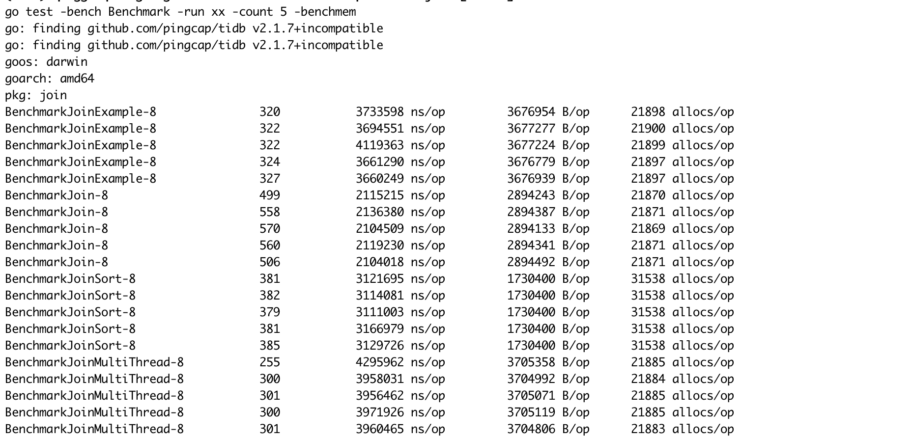
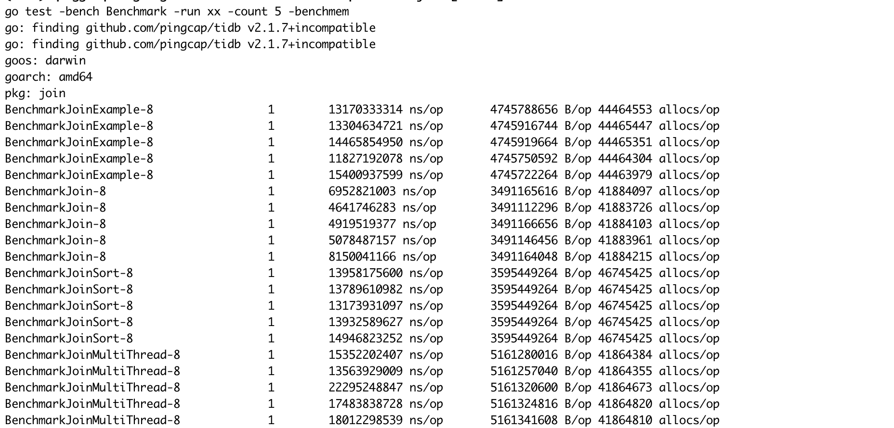
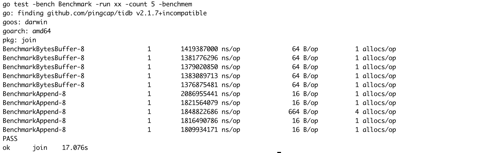
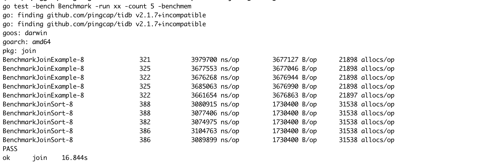
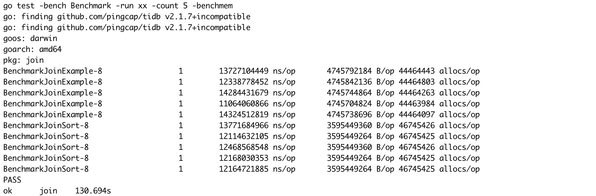
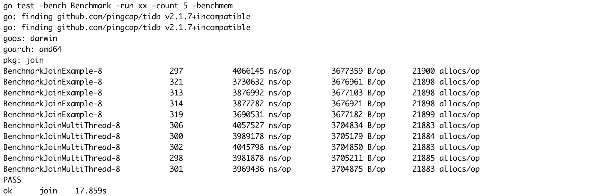
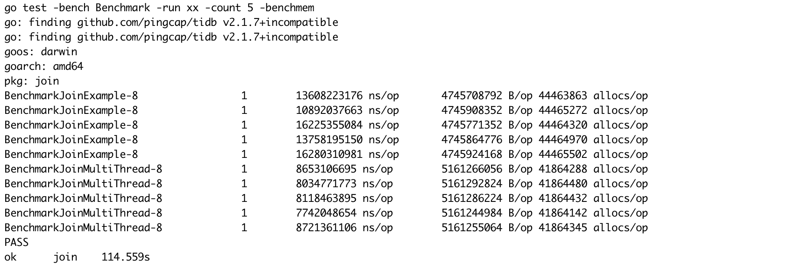
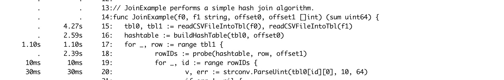
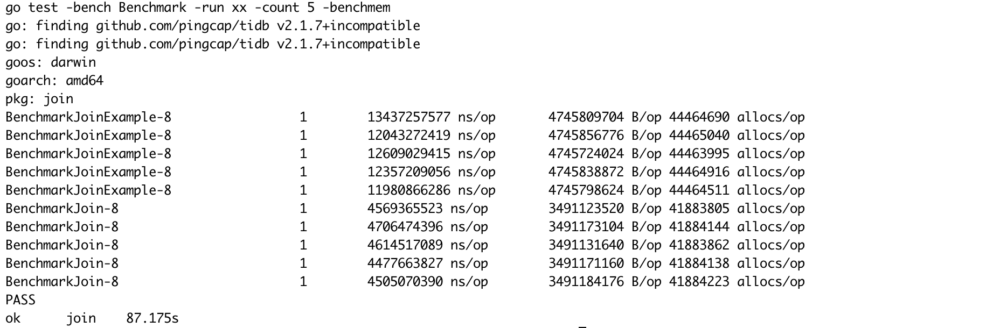

# Join

## 最终结果

**最终结果(左表10000行，右表500行)**



**最终结果(左表7790892行，右表7790892行)**



在大数据集上最优的优化了55%左右。

## 细节优化

### 使用`bytes.Buffer`代替`[]byte`

在`join_example.go/buildHashTable`和`join_example.go/prob`中，原先使用`[]bytes`通过`apppend`创建`key`，现在使用`bytes.Buffer`来创建`key`。

模拟`join`中构建`key`的过程的benchmark：

```go

func BenchmarkBytesBuffer(b *testing.B) {
	buf := &bytes.Buffer{}
	datas := []string{"12345678", "12345678"}
	for i := 0; i < 100000000; i++ {
		for _, data := range datas {
			buf.WriteString(data)
		}
		buf.Reset()
	}
}

func BenchmarkAppend(b *testing.B) {
	buf := make([]byte, 0, 8)
	datas := []string{"12345678", "12345678"}
	for i := 0; i < 100000000; i++ {
		for _, data := range datas {
			buf = append(buf, []byte(data)...)
		}
		buf = buf[:0]
	}
}
```

测试结果如下：



可以看到使用`byte.Buffer`有大约30%的性能提升。

### 在MVMap中存储第一列数值代替存储行数

在`join_example.go/probe`的时候取出符合**Join**条件的行数之后需要对表再访问存储一次，对于此次任务来说可以通过直接存储左表的第一列的值来避免这次访问。不过这样做会导致`buildHashTable`的逻辑和**Join**逻辑耦合。

## 框架优化

### 朴素的Sort + Scan Join

使用`Sort + Scan` 实现Join算法，分析表中的行的特点可以用`radix sort`来加速`sort`过程，将连接条件中的列数值用`_`拼接，在最后加上两个表的`id`，左表为`0`，右表为`1`，这样能保证排序后满足**Join**条件的左表的行在右表的上面，最后在Id后面加上需要做计算的列。



可以看到在左表10000行，右表500行的时候，sort的性能比原有的Hash Probe的方法好一点，主要原因是建立Hash表的时间大于小数据集上的`radix sort`时间。



上图为在200M大数据集（左表右表都是200M的数据集）进行**Join**的测试结果，发现Sort Join和原有的Hash Probe性能差别不大。

### 并行Probe

对于**No Partition Hash Join**先排除并行`BuildHashTable`的做法，因为Golang没有一个类似Java的ConcurrentMap的好的实现，这将会导致对`Map`的并发写入性能十分低下。而`Probe`过程是个只读过程，不同线程的读取不会影响其他线程，所以可以将右表切分为多块，然后并行probe，最后获得结果。



这是左表10000行右表500行的测试结果，发现性能甚至比单线程`prob`更慢，这是因为右表过小，多线程的优势没有体现出来，交换一下左右表的大小效果会很明显。



这是左表200M右表200M的测试结果，此时`probe`过程占比更多，多线程优化了`probe`过程，导致整体性能提升了30%左右。

### 边读边计算



通过**pprof**的统计数据我们发现读取文件耗费的时间和`buildHashTable`，`probe`的耗费时间相当。可以考虑并行化IO和计算，使用**边读边计算**的生产者消费者模型来并行读取文件和计算过程，在读取一定数量（比如一个磁盘的Block大小）的数据后将数据发送到计算线程计算。

显然生产者线程只有一个，因为磁盘读写并行起来蠢，因为文件是连续的，相比于单线程的顺序读取，并行读取反而会造成更多的性能损失，而消费线程可以有很多个，消费线程的消耗能力大于生产线程的话也会造成消费线程空等的状态（不考虑Golang调度的影响），根据pprof的分析，在我的机器中磁盘读速度和计算速度相差不大，并且多个计算线程执行并行`buildHashTable`的话也会造成额外的同步开销，所以选择一个生产线程一个消费线程的模型。

#### 生产者1 消费者1


这是左表10000行右表500行的测试结果，并行化IO和计算之后性能接近一倍的提升，这是符合预期的，因为在上面的pprof性能分析中`buildHashTable`和`probe`的时间耗费和读取文件相当，并行这个过程之后将会是总时间减少一半。



在大数据集上性能提升更加明显。

