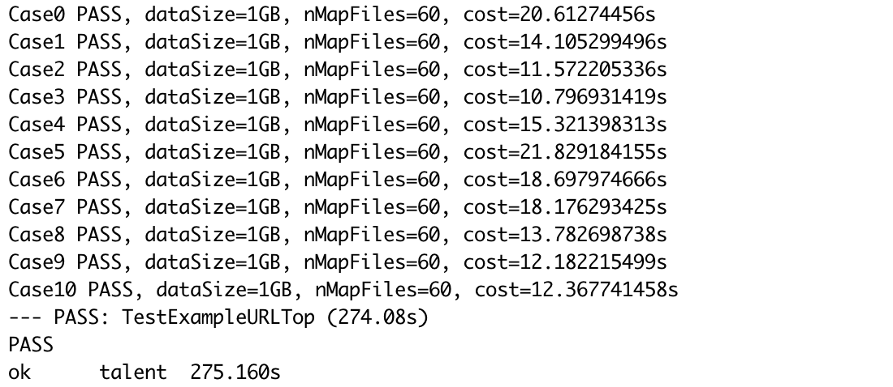
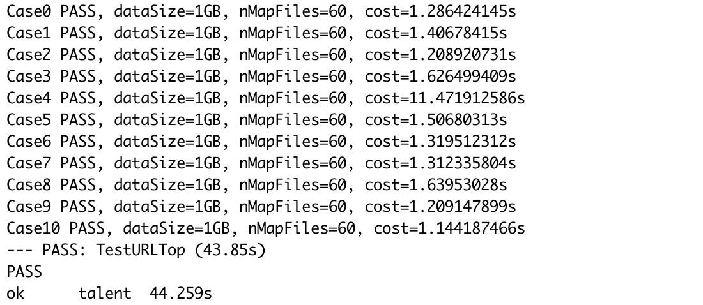
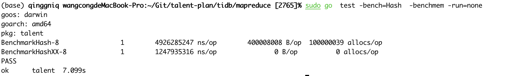
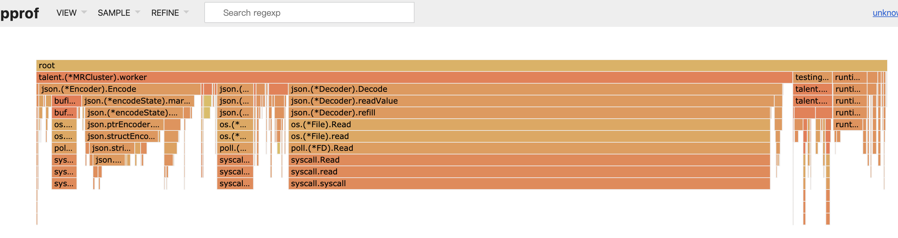

# MapRedude

## 结果

### make test_example



上面的结果是已经对细节优化后的实验结果，在没进行细节优化之前不能测试的时间超过了10min的限制，就不列出来了。

### make test_homework



以上是优化**MapReduce**过程后的效果，大概是7倍的性能提升。

## 细节上的优化

### 使用xxhash代替内置hash

通过pprof的list发现ihash函数速度过慢，分析代码执行时间发现主要是 `h.Write([]byte(s))`花费时间过长，它会拷贝输入的`string`然后生成一个`byte`数组，耗时严重。然而更改框架避免强转不如使用**碰撞率**和**hash速度**都具备优势的[xxhash](https://github.com/cespare/xxhash)实现，写了一个简单的benchmark对一个字符串哈希1e8次，性能比较结果如下：



以上结果是在去掉原有的`ihash`函数中类型转换的步骤后的比较结果，可以看到无论是时间还是空间性能方面都领先于内置hash。

### 使用josniter代替ecode/json



通过pprof工具产生的svg图可以看到主要是joson的编码和解码过程花费时间过长，网上搜索后得知go官方的json库一直被人诟病速度慢，于是更换为[jsoniter](https://github.com/json-iterator/go)。当然如果不考虑数据格式，可以不使用json文件格式存储结果，使用csv格式或其他更简单的文件格式可以达到更高的性能。

### 提前初始化json.Encoder

使用`go-torch`发现在json解析的过程中，**Map**阶段的`json.NewEncoder`占用时间过长。从**Map**的逻辑可以知道一次**Map**过程产生`nReduce`个中间文件，所以`json.NewEncoderz`在一次**MapReduce**过程实际上最多只需要调用**nReduce**次，然而模板代码里面的`json.NewEncoder`函数调用了`len(kvs)`次，做了大量的无用工作，所以可以将`enc`的初始化提前初始化。


## mapreduce过程优化

### 例子过程

在`URLTop10Example`程序的各轮**MapReduce**的逻辑如下

#### 第一轮

**Map**

输入为存储URL的文件，读取文件中的URL，输出为`<url, "">`格式的`KeyValue`结构体。

**Reduce**

输入为`<url, ["", "" ... , ""]>`，前面是要统计的URL，后面的空字符串数组长度为URL出现的次数，输出代表字符串以及出现次数的`"url occurrences"`格式字符串。

#### 第二轮

**Map**

输入为每行为`"url occurrences"`格式的文件内容，读取，输出为`<"", "url occurrences">`格式的`KeyValue`结构体数组。

**Reduce**

输入为`<"", ["url0 occurrencs0", "url1 occurrences1"...]>`，前面空字符串是为了让**Map**出来的结果在一个**Reduce**过程上Reduce，后面是整个**MapReduce**输入文件中的URL以及它的出现次数，统计并排序输出最终**Top10URL**。

### 例子过程的一些缺陷

- 第一轮的**MapReduce**过程几乎没有减小机器需要处理的数据量，使用数组长度作为出现次数十分低效。
- 第二轮的**Map**过程没有过滤掉大部分的无用中间结果，由于求解的问题是**Top10**问题，那么可以断言最终的**Top10URL**必然出现在每个**Map**文件里面的**Top10URL**，而第二轮的**Map**过程并没有过滤掉那些信息。

### 针对例子过程的优化

#### 第一轮

**Map**

输入为存储URL的文件，读取文件中的URL，并统计此文件中各个URL的出现次数，输出为`<url, occurrences>`格式的`KeyValue`结构体。

**Reduce**

输入为`<url, [occurrences0, occurrences1 ... , occurrencesn]>`，前面是要统计的URL，后面的空字符串数组的和为URL出现的次数，输出代表字符串以及出现次数的`"url occurrences"`格式字符串。

#### 第二轮

**Map**

输入为每行为`"url occurrences"`格式的文件内容，读取并计算其中的**Top10URL**，输出为`<"", "url occurrences">`格式的`KeyValue`结构体数组。

**Reduce**

输入为`<"", ["url0 occurrencs0", "url1 occurrences1"...]>`，前面空字符串是为了让**Map**出来的结果在一个**Reduce**过程上Reduce，后面是整个**MapReduce**输入文件中的URL以及它的出现次数，统计并排序输出最终**Top10URL**。

### 优化的部分

- 在**第一轮**的**Map**时候就计算各个URL的出现次数，导致**Map**的输出数据量减少。
- 在**第二轮**的**Map**的时候计算改文件的**Top10URL**，导致**Map**的输出数据量减少。

#### 创建map时设置初始map大小

在文件中单词分布均匀（比如Case4）的情况时，第一轮**Map**过程中的词频统计所用到的`hashmap`就会需要很大的空间，如果不给初始**map**设置大小，那么在处理的时候就会触发$O(log(N))$（N为URL个数）次扩容，造成极大的时间空间性能损耗。在程序中设置`map`大小为行数，在数据倾斜的情况下可能会造成空间的浪费，但是在数据均匀的情况下极大的优化了时间。

## 考虑过又放弃的优化

#### 使用simdjson解析文件

考虑到Json解析一直是个性能瓶颈，考虑过使用不同的Json解析器来替代原有的实现。

[simdjson-go](https://github.com/minio/simdjson-go)是[simdjson](https://github.com/lemire/simdjson)的go移植，使用**smid**指令并行处理数据，使用位操作避免分支预测，根据它的benchmark，**simdjosn**能达到其他Json解析库20倍以上的性能，**simdjson-go**也能相比于**json-iterator**也能达到平均十倍左右的性能。然而实际替换之后发现效果并不明显，写了一个benchmark模拟reduce过程的时候解析**Reduce**的输入文件并统计相同URL的出现次数。


可能是输入文件过小，Json格式比较简单，在所有的输入样例中最大的需要解析的Json文件也就只有2.3MB。

#### 使用不同的word count方法

- 使用sort merge统计词频
- 使用TireTreeMap替代内置Map

效果并不理想，而且不管是在小数据集还是大数据集上，效果都没有使用内置`map`统计效果好。

#### 使用bufio.Scan方法逐行读数据


从场面的图可以看到其中`strings.genSplit`占据了`URLCountMap`（也就是第一轮**Map**过程）的大部分时间。

```go
func URLCountMap(filename string, contents string) []KeyValue {
	lines := strings.Split(contents, "\n")
	cnts := make(map[string]int64, len(lines))
	for _, url := range lines {
		if len(url) == 0 {
			continue
		}
		cnts[url]++
	}
	kvs := make([]KeyValue, 0, len(cnts))
	for url, cnt := range cnts {
		kvs = append(kvs, KeyValue{Key: url, Value: strconv.FormatInt(cnt, 10)})
	}
	return kvs
}
```

可以看到`strings.genSplit`是`strings.Split(content, "\n")`的函数，使用边读边计算的方式试图避免这次`strings.Split`的额外的性能开销。


使用Case4 1GB时的第一个**Map**输入文件测试，发现替换为边读计算的方式后性能反而下降了。除了边读边处理无法预先得知URL个数之外，还有`bufio.Scanner.String()`方法对`[]byte`类型的转换会影响效率。


