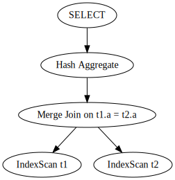

# QueryPlan

Join一般有**Hash Join**、**Merge Sort Join**、**Tale Lookup Join**，而聚合一般也分为**Hash Aggregate**和**Stream Aggregate**，而扫描也会根据索引的有无分为**Index Scan**和**Table Scan**。根据这些不同，理论上`select t1.a, count(*), avg(t1.b) from t1 left outer join t2 on t1.a=t2.a group by t1.a`的Query Plan有$2^3 \times 3$种情况，不同的Join和聚合算法，两个表不同的扫描方法。然而可以根据这条SQL语句的特点，重写为更简单的等价语句，去掉一些可能性。

考虑到这是一个**左外连接**，那么我们可以根据外表`t2.b`的唯一性来做一些逻辑优化。

## t2.a唯一

```SQL
select t1.a, count(*), avg(t1.b) from t1 left outer join t2 on t1.a=t2.a group by t1.a
```

上面的**SQL**含义为选择表`t1`和`t2`找到`t1.a`和`t2.a`相同的记录并保留`t1.a`在`t2.a`中没有的记录，然后算出根据`t1.a`做聚合，算出`t1.a`相同的记录数和`t1.a`相同时`t1.b`的平均值。

当`t2.a`唯一时，最终的结果与`t2`的记录无关，所以可以消去左外连接语句，重写为下面的SQL语句：

```SQL
select t1.a, count(*), avg(t1.b) from t1 group by t1.a
```

那么这条语句的操作子就只有聚合操作了。可以根据`t1.a`的有无索引（btree索引）来划分不同情况。

## 执行计划

### t1.a中没有索引

#### Hash聚合


#### Stream聚合


### t1.a上有btree索引

### hash聚合


#### Stream聚合


## t2.a不唯一

`t2.a`不唯一的时候，投影中的`count(*)`就会收到`t2.a`中符合**Join**条件`t2.a`相同值个数的影响，所以无法消去左外连接。

依然可以根据两个表上是不是有索引来分情况讨论它们的执行计划（为了简化讨论我们不考虑两个表中`a`字段索引一个有一个没有的情况，只考虑全部有或全部没有的情况，并且索引只考虑有序的btree索引，不考虑hash索引）。

### 有索引时

在有索引的时候，Join算法就可以线性执行，所以不考虑**Hash Join**的情况。

#### Stream聚合


#### Hash聚合



### 没有索引

#### hash聚合

##### sort merge join


##### Hash Join


#### stream聚合

##### sort merge join


##### hash join


 

## t1.a不同数据分布的影响

### 聚合

#### 有索引时

有索引后，数据自身有序，并且理论上不需要额外的磁盘IO。

##### Hash聚合

**Hash聚合**时需要再内存里临时建立Hash表来存储聚合的中间结果，并且Hash表的大小与**组数**成正比，**组数**指聚合的字段不同值的数量，**组数**与记录行数和数据分布有关，数据分布的越均匀，**组数**越多，Hash表越大，空间复杂度越大；**组数**越少，Hash表越小，空间复杂度越低。

##### Stream聚合

如果`t1.a`字段上有btree索引，所以**Stream聚合**可以直接聚合而不需要从磁盘里面读出表数据后再额外的排序，计算复杂度为$O(n)$，n是`t1`中记录的行数。由于**Stream聚合**直接扫描运算即可，所以`t1.a`的数据分布不会影响查询的性能。

#### 没有索引时

没有索引时，需要从磁盘里面读入数据，磁盘IO消耗与记录行数成正比。

##### Hash聚合

同有索引时不同数据分布对Hash聚合的影响一样。

##### Stream聚合

`t1.a`字段上没有索引，所以**Stream聚合**需要先对数据排序，然后再进行聚合，排序复杂度为$nlog(n)$

，聚合复杂度为$O(n)$，$n$是`t1`中记录的行数。排序和**Stream**聚合都与数据分布无关，所以`t1.a`的数据分布不会影响查询的性能。

### Join

`t1.a`的不同数据分布对连接操作的影响与聚合操作的影响类似，不再赘述。

### 总结

<table>
   <tr>
      <td></td>
      <td>有索引</td>
      <td></td>
      <td>无索引</td>
      <td></td>
   </tr>
   <tr>
      <td></td>
      <td>Hash聚合</td>
      <td>Stream聚合</td>
      <td>Hash聚合</td>
      <td>Stream聚合</td>
   </tr>
   <tr>
      <td>时间复杂度</td>
      <td>O(N)</td>
      <td>O(N)</td>
      <td>O(N)</td>
      <td>O(Nlog(N))</td>
   </tr>
   <tr>
      <td>空间复杂度</td>
      <td>O(M)</td>
      <td>O(1)</td>
      <td>O(M)</td>
      <td>O(1)原地归并</td>
   </tr>
   <tr>
      <td>IO</td>
      <td>None</td>
      <td>None</td>
      <td>O(N)</td>
      <td>O(N)</td>
   </tr>
</table>

注：$N$为记录**行数**；$M$为**组数**。

在聚合的时候，Hash聚合需要建立hash表的初始化**常数时间**，所以在数据量小的情况下**Stream聚合**比**Hash聚合**时间效率更优。

